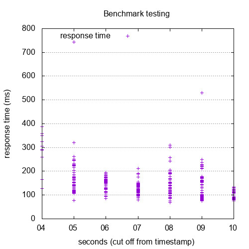

# docker-apache2-utils

ApacheBench (ab) is the default entrypoint, which can be overwritten with e.g. `--entrypoint /usr/bin/htpasswd`

## Usage

`$ docker run --name ab --rm tullo/ab -r -n 400 -c 10 http://example/`

### Generate gnuplot readable file

Use the `-g` switch to tell ab to write a 'gnuplot file' ready for post prcessing via gnuplot

```
$ docker run -it --name ab --rm --entrypoint /bin/sh tullo/ab
$ ab -r -n 400 -c 10 -g gnuplot.tsv http://example/
```

### Apache Benchmark and GNU Plot

Let's try to look at response time (in ms) over time (seconds, serially)

```
$ docker cp ab:/gnuplot.tsv ./gnuplot/data/gnuplot.tsv
$ cd gnuplot && gnuplot jpegplot.script
```
